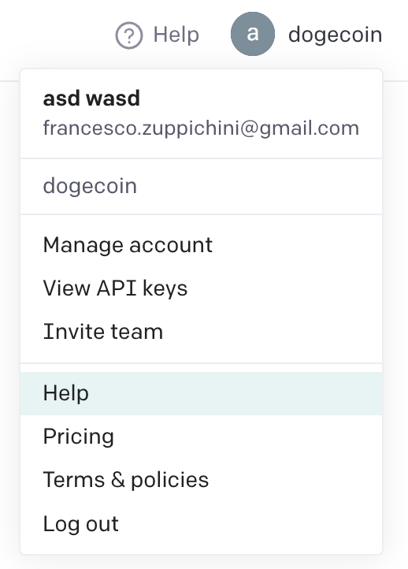
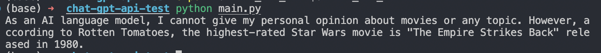
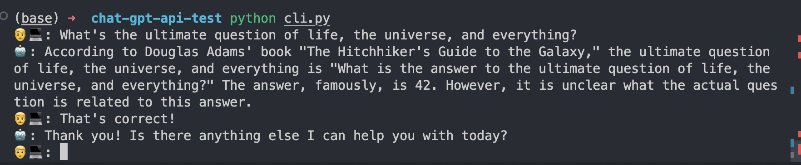

# How to use ChatGPT with Python 🤖🐍

*Hey, I am on [LinkedIn](https://www.linkedin.com/in/francesco-saverio-zuppichini-94659a150/) come and say hi 👋

[OpenAI ChatGPT](https://openai.com/blog/chatgpt) APIs are out! They open a new endless possibilities. Today we're going to see how to use them in Python

## Setup

### Get an API key

Log into [OpenAI website](https://openai.com/) and, if you are not on the free tier, add a credit card. 
After that go to the profile section (top right) and click on `View API keys`.



 Then click on `Create new secret key` and store your key, you will need it later.

### Install pip package

Now, install the [`openai` pip package](https://github.com/openai/openai-python) 

```
pip install --upgrade openai
```

We're ready to go!

## Make a simple request

The official doc is [here](https://platform.openai.com/docs/guides/chat?utm_medium=email&_hsmi=248334739&utm_content=248334739&utm_source=hs_email). To make a simple request, you will need to import the `openai` package and call the `openai.ChatCompletion.create` method by passing the model id and a list of messages.

```python
# main.py
import openai

chat_completion = openai.ChatCompletion.create(
    model="gpt-3.5-turbo",
    messages=[
        # system message first, it helps set the behavior of the assistant
        {"role": "system", "content": "You are a helpful assistant."},
        # I am the user, and this is my prompt
        {"role": "user", "content": "What's the best star wars movie?"},
        # we can also add the previous conversation
        # {"role": "assistant", "content": "Episode III."},
    ],
)
```

`messages` is a list of dictionaries with key `role` and `content`. `role can be `system`, use it to set the bot behaviour, `user` is the user interacting with the bot (ourself) and `assistant` is the chatbot. Inside `content` we place our text.

We need to have export `OPENAI_API_KEY` in order to let OpenAI knows who we are. Set the env variable `OPENAI_API_KEY` to the one you have created before

```
export OPENAI_API_KEY=<YOUR_OPENAI_API_KEY>
```

Then, we can run the python script with the code above:



ChatGPT replies: *As an AI language model, I cannot give my personal opinion about movies or any topic. However, according to Rotten Tomatoes, the highest-rated Star Wars movie is "The Empire Strikes Back" released in 1980.*

## Creating a chat cli

We can go one step further by creating a little interactive chat we can run in the terminal

```python
# cli.py
import openai
import os


messages = [
    # system message first, it helps set the behavior of the assistant
    {"role": "system", "content": "You are a helpful assistant."},
]

while True:
    message = input("👨‍💻: ")
    if message:
        messages.append(
            {"role": "user", "content": message},
        )
        # doc is here https://platform.openai.com/docs/guides/chat/chat-vs-completions?utm_medium=email&_hsmi=248334739&utm_content=248334739&utm_source=hs_email
        chat_completion = openai.ChatCompletion.create(
            model="gpt-3.5-turbo", messages=messages
        )
    # get the reply
    reply = chat_completion.choices[0].message.content
    print(f"🤖: {reply}")
    messages.append({"role": "assistant", "content": reply})
```

Then, assuming you have the code inside `cli.py`, we can run it (remember to set the env variable `OPENAI_API_KEY`) 

```
python cli.py
```

And we can use ChatGPT in the terminal 



Amazing, he knows the answer! 🎉

## Conclusion

This was a quick tutorial about how to use the new ChatGPT APIs in python, the possibilities are infinite!

See you in the next one 🚀

Fra